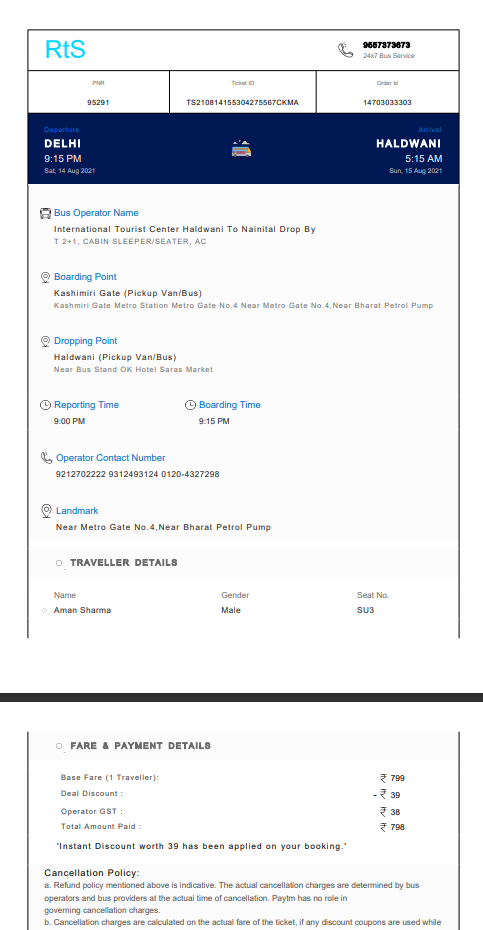

# Invoice-Ticket-For-Customers-Using-Itext7
Simple Ticket Using itext7 library in Java

## Table of contents

- [Overview](#overview)
  - [Screenshot](#screenshot)
- [My process](#my-process)
  - [Built with](#built-with)
- [Link](#author)

## Overview

### Screenshot
Here is the result!

## My process

### Built with

- itext7 library
- Maven
- Java

## Link

- Github - [ashu305](https://github.com/ashu305)
